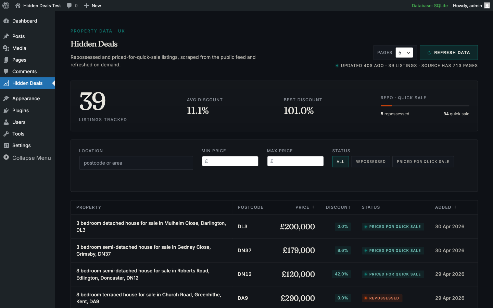
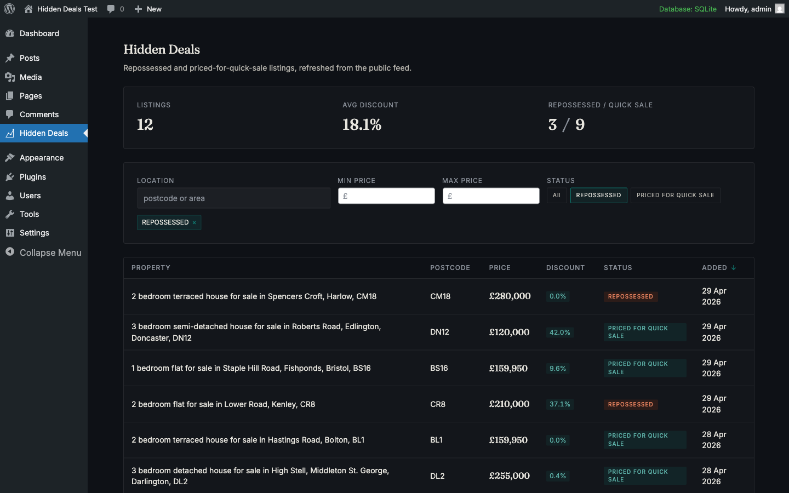
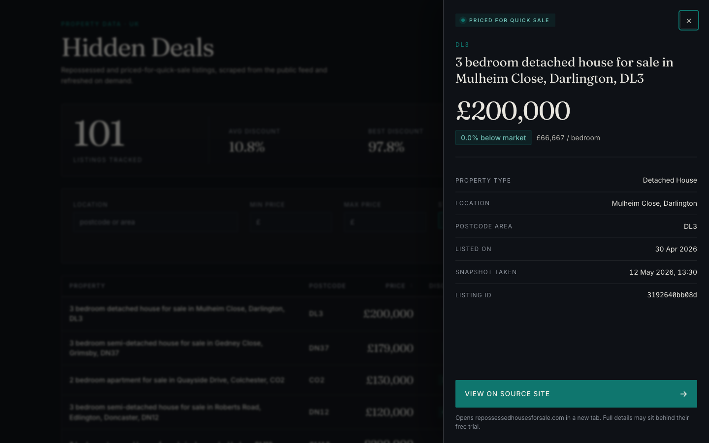
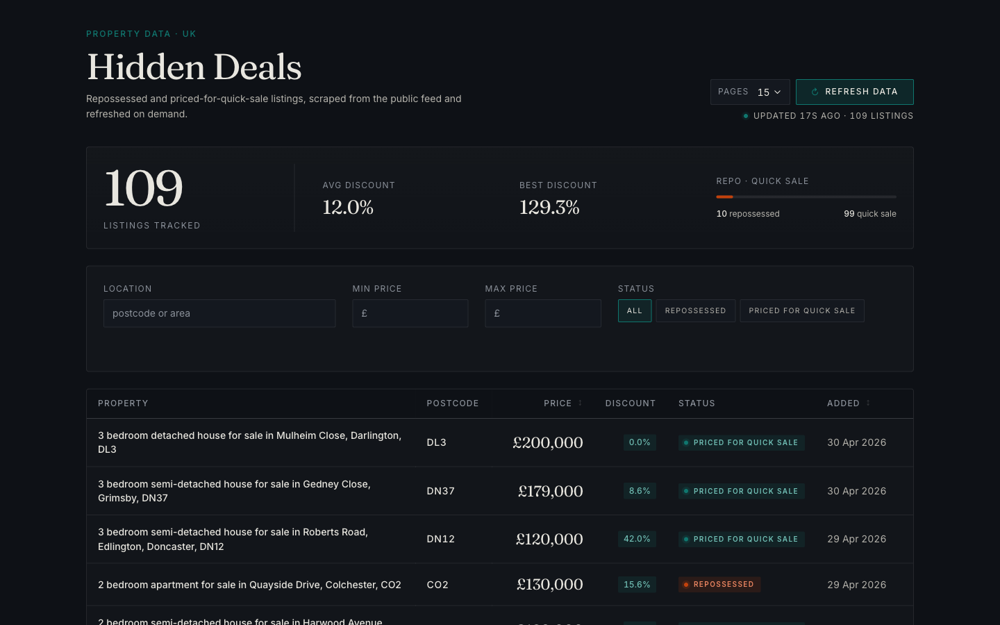

# hidden deals

Three small projects in one repo because they only make sense together.

A Python scraper pulls public property listings off `repossessedhousesforsale.com`. A small Express service serves what the scraper writes. A React dashboard reads from that service and embeds into wp-admin as a plugin.

Public index pages only. Anything behind the "Start free trial" wall isn't touched.

## Layout

```
data/listings.json        most recent scrape
scraper/                  requests + bs4 + tenacity, pytest
api/                      plain express, zod, supertest
wordpress/
  react-app/              vite + react 18 + ts, tanstack table & query
  plugin/hidden-deals/    the php plugin + bundled dashboard
Makefile
screenshots/
```

## Run it

```sh
make install
make scrape       # ~10 listings/page, defaults to 15 pages
make api          # :3000
```

In another terminal:

```sh
make dashboard    # vite at :5173, talks to the api
```

For the production bundle the wp plugin enqueues:

```sh
make build
```

That lands `hidden-deals.js` and `hidden-deals.css` straight into `wordpress/plugin/hidden-deals/build/`.

## API

`GET /health` returns `{ ok, listings, loadedAt }`.

`GET /api/listings` returns `{ count, total, aggregates, results }`. Query params are `minPrice`, `maxPrice`, `location`, `status`, `sort` (`price_asc | price_desc | recent`), `limit` (default 50, max 200), `offset`. The `aggregates` block — `avgDiscount`, `maxDiscount`, `repossessedCount`, `quickSaleCount` — is computed over the *filtered* set, not the current page. Once infinite scroll was in place, computing it client-side made the average discount drift as you scrolled, which felt wrong.

`POST /api/scrape` with `{ maxPages: 1..50 }` spawns the Python scraper as a subprocess and returns `202 { job }`. On its first fetch the scraper reads the source's pagination and caps the run at the smaller of `maxPages` and the site's actual page count. Both numbers come back in the job, so the dashboard can show "scraping 4 / 5" even if you asked for 50.

`GET /api/scrape/status` returns `{ job }`. The dashboard polls this every 700ms while a job is running and invalidates the listings query when status flips to `done`.

Quick tour:

```sh
curl 'http://localhost:3000/api/listings?minPrice=100000&maxPrice=200000&sort=price_asc&limit=3'
curl 'http://localhost:3000/api/listings?location=DN37'
curl 'http://localhost:3000/api/listings?sort=banana'   # 400, bad field surfaced

curl -X POST http://localhost:3000/api/scrape \
  -H 'content-type: application/json' \
  -d '{"maxPages": 5}'
curl http://localhost:3000/api/scrape/status
```

Bad input returns 400 with the offending field surfaced:

```json
{
  "error": "bad_request",
  "issues": [
    { "path": "sort", "message": "Invalid enum value. Expected 'price_asc' | 'price_desc' | 'recent', received 'banana'" }
  ]
}
```

The api watches `data/listings.json` and hot-reloads it on rename. The scraper writes via temp+rename, so a fresh scrape (via `make scrape` or the dashboard button) updates the live api without a restart.

CORS allows `http://localhost:5173` (vite dev) and `http://localhost:8080` (a local wp admin). Override with `CORS_ORIGINS`.

## Screenshots

Inside wp admin, full list:



Status filter applied — the active filter chip appears below the controls, the url picks up `?status=repossessed`:



Clicking a row opens a side drawer with photos and a link to the source listing:



The "refresh data" button kicks off the Python scraper. After a run the status line reports how many listings were found and the source's advertised page count:



## Design notes

JSON on disk because nothing writes concurrently and the dataset fits in memory. The scraper writes atomically (temp + rename), the api re-reads on rename. The day a second thing needs to write is the day to move to SQLite.

TanStack Query for the dashboard because url-driven filter state and remote state work better as separate concerns. The url state itself is plain `URLSearchParams` + `history.replaceState`. I tried `react-router` for the url part, didn't like the imports, reverted. The revert is in the log.

No Tailwind. CSS modules per component, about a dozen flat tokens in `tokens.css`. A solo build needs type rhythm and table density more than it needs utility classes. Fraunces for headings and prices, Inter for everything else, both self-hosted via woff2 so wp-admin doesn't reach out to googleapis.

Vite is configured to emit exactly two top-level files — `hidden-deals.js` and `hidden-deals.css` — using `inlineDynamicImports` and `cssCodeSplit: false`. Fonts and other assets land in `build/assets/` and the css references them relatively. The script tag is force-emitted with `type="module"` via a `script_loader_tag` filter, because Vite ships ES modules and wp's default enqueue is classic-script. Took me a minute to spot that one.

Infinite scroll is `useInfiniteQuery` with a 320px-rootMargin `IntersectionObserver`. Sorting is server-side because client-side sort over a partial dataset is a lie; the table runs in `manualSorting` mode and writes the chosen sort back into the url.

## Known limitations

- No auth on the api. Anyone reachable can hit it, including `POST /api/scrape` which spawns a Python process. The 50-page cap and the site's own pagination ceiling are the only soft guards.
- Photos hot-link to the source CDN. If they rotate URLs the dashboard shows broken thumbnails until the next scrape. Local mirroring would mean keeping a media store.
- The parser anchors on text and link shape, not class names, but a deep redesign of the source would still break it. Roughly one listing in every hundred parses without a title (price preserved). I leave those in rather than drop them.
- No CI, no Docker. Tests run by hand: `pytest`, `npm test`, both fast.
- `fs.watch` is a single-machine convenience. A real deployment would push the json through a queue or just rebuild on a cron.

## With more time

- Virtualise the table rows. Infinite scroll is fine up to maybe 500 rows; past that the DOM starts to feel it.
- A permalink for a specific listing — `?focus=<id>` opens the drawer on load.
- A small GitHub Action: pytest, `node --test`, `vite build`. Maybe an hour of work.
- A weekly cron that snapshots a fresh page of html into `scraper/tests/fixtures/`, so parser tests catch source changes before production does.
- Persist filter presets per wp user via a small admin-ajax endpoint.
- SQLite + WAL once more than one thing writes.
