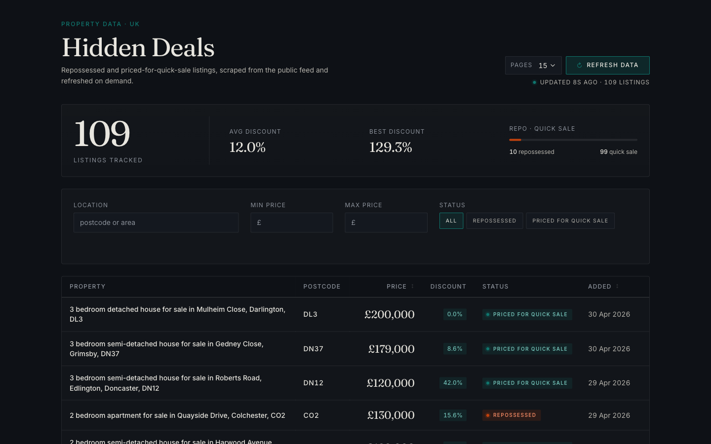

# hidden deals

A weekend trial build. Three small projects in one repository: a Python scraper
that pulls public listings from `repossessedhousesforsale.com`, a Node/Express
API that serves them with filters, and a React dashboard that surfaces them
inside the WordPress admin. Nothing behind the site's "Start free trial" wall
is touched — only the public index pages.

## Layout

```
.
├── data/listings.json          seed dataset from a real scrape
├── scraper/                    requests + bs4 + tenacity, with pytest
├── api/                        plain express, zod-validated, supertest
├── wordpress/
│   ├── react-app/              vite + react 18 + ts, tanstack table & query
│   └── plugin/hidden-deals/    php plugin + the bundled dashboard
├── Makefile
└── screenshots/                from a local wp install
```

## Quickstart

```sh
make install
```

Scrape ~150 listings into `data/listings.json`:

```sh
make scrape
```

Start the API and the dashboard in two terminals:

```sh
make api          # http://localhost:3000
make dashboard    # http://localhost:5173 with VITE_API_URL pointing at the api
```

To build the bundle that WordPress enqueues:

```sh
make build        # writes hidden-deals.js + hidden-deals.css into wordpress/plugin/hidden-deals/build/
```

## API contract

`GET /health` returns `{ ok, listings, loadedAt }`.

`GET /api/listings` accepts `minPrice`, `maxPrice`, `location`, `status`,
`sort`, `limit`, `offset` and returns `{ count, total, aggregates, results }`.
The `aggregates` block holds `avgDiscount`, `maxDiscount`, `repossessedCount`,
and `quickSaleCount` for the full filtered set (not just the current page).

`POST /api/scrape` with `{ maxPages: 1..50 }` spawns a background scrape job
and returns `202 { job }`. A second call while a job is running returns `409`.
The scraper reads the source's pagination on its first fetch and caps the run
at the smaller of `maxPages` and the site's advertised page count — both
numbers are reported back in the job (`maxPages`, `effectiveMaxPages`,
`sourceTotalPages`).

`GET /api/scrape/status` returns `{ job }` with the current progress
(`status`, `pagesScraped`, `totalListings`, `sourceTotalPages`, `error`).

Sample requests:

```sh
curl 'http://localhost:3000/api/listings?minPrice=100000&maxPrice=200000&sort=price_asc&limit=3'
curl 'http://localhost:3000/api/listings?location=DN37'
curl 'http://localhost:3000/api/listings?status=repossessed&sort=recent'
curl 'http://localhost:3000/api/listings?sort=banana'   # 400

curl -X POST 'http://localhost:3000/api/scrape' \
  -H 'content-type: application/json' \
  -d '{"maxPages": 15}'
curl 'http://localhost:3000/api/scrape/status'
```

A bad parameter produces a 400 with the offending field surfaced:

```json
{
  "error": "bad_request",
  "issues": [
    { "path": "sort", "message": "Invalid enum value. Expected 'price_asc' | 'price_desc' | 'recent', received 'banana'" }
  ]
}
```

The API watches `data/listings.json` and reloads it in place. Re-running the
scraper while the API is up updates `/health`'s `listings` count without a
restart. The `POST /api/scrape` endpoint spawns the Python module directly
(`python -m scraper.main`); the API resolves the interpreter from
`./.venv/bin/python` if present, falling back to `python3` on `PATH`.

## Screenshots

The dashboard inside WP admin, full list:


With a status filter applied — the chip appears below the controls, the URL
gets `?status=repossessed`, and the table re-sorts:


Clicking a row opens a detail drawer with a photo gallery, price-per-bedroom,
location, dates, and a link out to the source listing:


The "Refresh data" button in the header runs the Python scraper on demand and
shows live progress. The table refetches when the job completes:




## Design notes

A monorepo because the three projects only make sense together — the API
reads what the scraper writes, the React app reads what the API serves, and
the WordPress plugin enqueues the React build. Splitting them into separate
repos would create three places to push fixes to instead of one.

JSON-on-disk instead of a database. The scraper writes the whole file
atomically (temp + rename), the API reads it once at boot and on every
rename, and that's enough for ~150 records updated once a day. Adding SQLite
or Postgres would buy us concurrent writes we don't need.

TanStack Query handles caching, retries, and avoids the typical React
fetch-effect dance. URL state is plain `URLSearchParams` + `history.replaceState`
— I tried react-router for an hour, didn't like the imports it dragged in for
a single-page admin, and reverted (visible in `git log`). Filter chips
animate in and out with `framer-motion`, and that's the only thing
framer-motion does.

The design system is small on purpose: about a dozen CSS variables, one
breakpoint, named class modules per component. No Tailwind — the dashboard
needed type and rhythm, not utilities. Fraunces handles headings and prices,
Inter handles everything else. Both are bundled as woff2 with `font-display:
swap`, so WP admin never reaches out to `fonts.googleapis.com`.

Vite is configured to emit exactly two named files (`hidden-deals.js`,
`hidden-deals.css`) so the WP enqueue calls are boring. The script tag is
emitted with `type="module"` via a `script_loader_tag` filter — Vite ships
ES modules and WP's default enqueue is classic-script.

## Known limitations

- No auth on the API. Anyone reachable on the network can hit it, including
  the `POST /api/scrape` endpoint that spawns a Python process. Behind a
  proper auth check, the page-count cap (50) is the only safeguard.
- CORS allows `http://localhost:5173` and `http://localhost:8080` by default
  (the Vite dev server and a local WP admin). Override with `CORS_ORIGINS`
  as a comma-separated list. Without a matching origin the dashboard falls
  back to the bundled `mock.json` (12 real listings, photos included).
- The scraper is anchored on text patterns and link shape, not class names,
  but a sufficiently aggressive redesign of the source site still breaks it.
  Roughly one listing in every hundred fails to parse cleanly (price
  preserved, title left empty).
- Property photos are linked, not stored. They hot-link to the source CDN —
  if the source rotates them, the dashboard shows broken thumbnails until
  the next scrape.
- No Docker, no CI. Tests are run by hand (`pytest`, `npm test`).
- `fs.watch` is a single-machine convenience. A real deployment would push
  the JSON file through a queue or just rebuild the dataset on a cron.

## What I'd do with more time

- Pagination on both the API and the table — TanStack Table can virtualize
  rows for large lists, and `count/total/offset` is already in the response.
- A `/listings/:id` route once individual property pages have something useful
  to show. Right now the row click opens the source URL in a new tab.
- A small GitHub Action: `pytest`, `node --test`, `npm run build`, on every
  push.
- Snapshot the seed HTML weekly into `tests/fixtures/` from a cron so the
  parser tests catch site changes before they hit production.
- Persist filter presets per user, keyed off the WordPress user ID via a
  thin admin-ajax endpoint.
- Replace the JSON file with SQLite + WAL once we have more than one writer.
